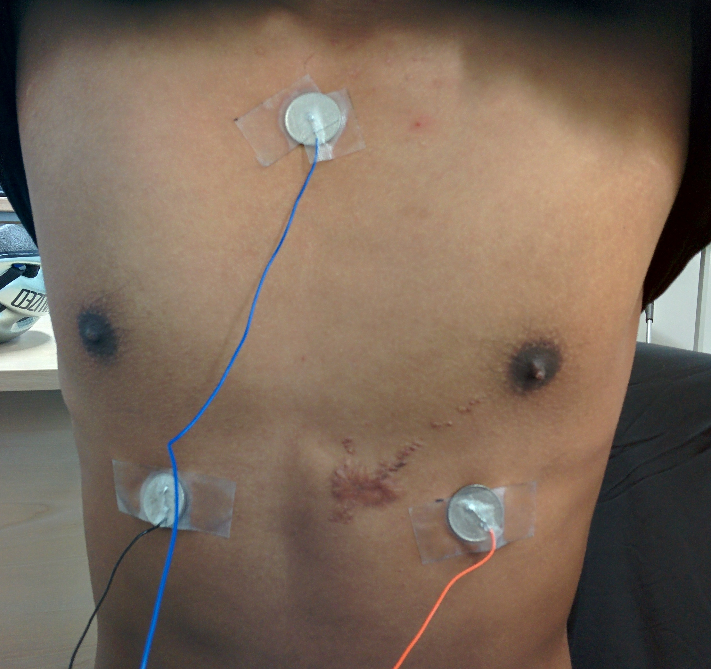

Hayden Ball
===========

My contribution to the project was focused on two areas: the project website and
working with Roy to design and build the sensor hardware.

Hardware
--------

The hardware element of the project consisted of designing sensors for the
health vest, installing them into the vest, and transferring data from the
sensors to the Android application which could then upload the data for further
processing and display.

The final design includes electrodes and analogue filtering circuitry to acquire
an electrocardiogram (ECG) of the wearer, and a sensor to allow monitoring of
the wearer's temperature.

The electrodes and temperature sensor are connected to a "belt pack" which
contained the ECG filtering circuit, a simple potential divider for the
temperature sensor, and the nRF51 Development Kit (nRF51-DK). The NRF51-DK
provides an easy interface to the nRF51822 microprocessor, which includes an
analogue to digital converter (ADC) and Bluetooth Low Energy transceiver.

### ECG Circuit

One of the more technically challenging aspects of the project was designing
and building a circuit for obtaining a clean ECG trace.

An ECG shows the change in electrical potential between two points on the body
caused by the depolarization and repolarisation of different heart muscles.

At first, this may appear to be a trivial problem to solve - we simply need to
build an amplifier to amplify the difference in potential between two electrodes
attached to the body. Unfortunately, there are also a number of challenges to
overcome.

The differential signal we are trying to obtain is in the order of 500μV,
meaning we must obtain a gain of around 30dB to obtain a usable signal. This,
as is to be expected with high gain amplifiers, introduces a large amount of
noise into the signal. Thankfully - for the basic QRS sequence we are interested
in - the signal frequency content is around 10Hz, allowing us to filter a large
amount of the noise introduced.

As the output of the circuit was to be sampled at around 25Hz, we also took care
to ensure that we had sufficient filtering beyond 12.5Hz to avoid aliasing.

Roy was responsible for the initial circuit design (based on Jason Nguyen's
circuit [^1]), which I then built and tested. Following initial testing, Roy and
myself worked together to tackle the challenges described above.

#### Circuit refinement

The initial circuit provided a recognizable ECG trace, shown below.

Although recognizable, the trace obtained contains a large amount of noise as
the first iteration of the circuit made little attempt to filter noise.

Using a Picoscope, we were able to identify the frequency of the noise
introduced:

We identified the troublesome frequencies as being 50Hz and its harmonics
(100Hz, 200Hz, 400Hz, etc), which was likely introduced by our power supply.
However, as these are beyond our desired signal frequency of 10Hz, we were able
to simply add a 2nd order low pass filter to remove the noise.

The addition of the low pass filter had a significant impact, resulting in the
following output:

The frequency trace clearly shows our new 40dB/decade roll-off above the
frequencies of interest, effectively removing the majority of noise present.
This also had the advantage of meeting our requirement of reducing frequencies
beyond 12.5Hz, preventing any aliasing issues.

#### Circuit Evaluation
discuss off the shelf alternatives

### Vest Electrodes
Up to this point, we have been testing using "Skintact" electrodes - an "off the
shelf" product that is designed to achieve good electrical contact between the
electrode and the skin. Unfortunately, the electrodes are single use and are
also uncomfortable (particularly when removing them!).

As part of the project we wanted to integrate the ECG electrodes into the vest,
removing the need for single-use electrodes, and providing more comfort to the
wearer. We also spent time investigating different placements of the electrodes,
with the aim of reducing movement artifacts (caused by electrical activity in
other muscles) and obtaining an acceptable input signal.

#### Electrode Placement

The generally accepted electrode placement for a 3 lead ECG has the -ve
electrode on the right side of the chest, just below the shoulder bone, the
ground electrode is placed on the left side of the chest, opposite the -ve
electrode, and the +ve electrode is placed in the 5th or 6th intercostal space
on the left side of the chest. Unfortunately, very large movement artifacts are
easily introduced, causing a complete loss of our desired signal.

<table>
  <tr>
    <td>
      
    </td>
    <td>
      
    </td>
    <td>
      
    </td>
  </tr>
  <tr>
    <td></td>

    <td>
      With little movement, a very clear trace is obtained (although in the
      image the +ve and -ve electrodes have been incorrectly connected,
      resulting in an inverted trace).
    </td>

    <td>
      However, with movement, the trace becomes unintelligible.
    </td>
  </tr>
</table>

After a little research, I came across an alternative electrode configuration
which is recommended for use in exercise physiology (which involves large
amounts of movement during tests). The configuration, introduced in "Exercise
Physiology: Nutrition, Energy, and Human Performance" [^2], has the ground
electrode on the sternum, with the -ve and +ve electrodes in the 5th intercostal
space on each side of the chest.

This placement produces a satisfactory trace, pictured below, which is less
susceptible to movement artifacts.

<table>
  <tr>
    <td>
      
    </td>
    <td>
      
    </td>
  </tr>
</table>

This positioning is also suggested by [^3].

#### Electrode design

Having decided on a suitable placement for the electrodes, I then spent a small
amount of time investigating different materials that could be used for the
electrodes. A number of papers ([^4][^5] to list two) have been published on
this subject in recent years, and provide interesting reading.

Unfortunately, the lead time and expense of such materials meant that it was not
practical to use such materials in the project. Instead, Roy and I attempted a
few different solutions.

One option that we considered was using parts of the Skintact electrodes, as
pictured below:

Unfortunately, we found that the sponge material used in the electrodes became
very fragile when it dried out, making it unsuitable for longer term use.

Another option was to use conductive copper tape. This was cut into small
sections of approximately 15mm, and stuck to the inside of the vest. While this
was somewhat successful, we found that performance was improved by adding a
slight bulge to the electrode. By wrapping the tape round a metal stud the
contact area is pushed into the skin a little more, improving the contact surface.

#### Evaluation

The vest is relatively comfortable to wear, with the main discomfort being
caused by the poor integration of the signal wires into the vest.

The requirement to use a conductive gel is disappointing, and makes putting on
the vest difficult. While not particularly uncomfortable, the design would be
significantly improved if this requirement could be removed. Given the amount
of research into conductive materials and wearable technology, it is likely that
this could be overcome with a little more time and research.

The output obtained from the vest leaves much to be desired.

The R and S sections of the trace are quite clearly visible (although small),
with the Q section of the trace occasionally obtained. However, the T section of
the trace is significantly distorted, and the P section is rarely seen.

<table>
  <tr>
    <td>
      
    </td>
    <td>
      
    </td>
    <td>
      
    </td>
  </tr>

  <tr>
    <td>
      The trace obtained using Skintact electrodes
    </td>
    <td>
      The final output from the vest and ECG circuit
    </td>
    <td>
      Movement artifacts seen in the final output
    </td>
  </tr>
</table>

As seen above, movement is still an issue. However, even during movement R and S
sections of the ECG trace can be identified. While it has not been possible as
part of the project, I would like to investigate in the future wheter
digital signal processing (particularly in combination with other sensors, such
as accelerometers) could be used to recover a reasonable ECG trace.

### Thermometer Circuit

A reasonably late addition to the vest was adding a thermister and incorporating
a potential divider circuit in the belt pack so that we could measure the body
temperature of the wearer.

I designed the (very simple) circuit for the sensor, which consisted of a
potential divider fed into an op-amp. The op-amp provided a suitably low output
impedence, ensuring that the measurement wasn't affected by current flowing into
the ADC of the nRF51822.

The thermistor was sewn into the vest under the right armpit. This is one of the
few locations on the body where skin temperature gives a good indication of core
body temperature.

The voltage produced by the potential divider was then converted into a
temperature by software running on the nRF51822, as discussed in the following
section.

#### Evaluation
further calibration required

### mbed Programming
#### Evaluation
discuss sampling

### Packaging
#### Evaluation
large beltpack

Website
-------

### Backbone
### Firebase
### Graphing

### Footnotes and References

[^1]:
  http://www.eng.utah.edu/~jnguyen/ecg/long_story_3.html

[^2]:
  Exercise Physiology: Nutrition, Energy, and Human Performance
  William D. McArdle, Frank I. Katch, Victor L. Katch
  PP327

[^3]:
  A Study on the Optimal Positions of ECG Electrodes in a Garment for the Design of ECG-Monitoring Clothing for Male
  Hakyung Cho, Joo Hyeon Lee
  Journal of Medical Systems, 2015, Vol.39(9), pp.1-14

[^4]:
  Wearable Textile Electrodes for ECG Measurement
  Lukas Vojtech, Radoslav Bortel, Marek Neruda, Milos Kozak
  Advances in Electrical and Electronic Engineering, 01 January 2013, Vol.11(5), pp.410-414

[^5]:
  Fabrication of conductive fabric as textile electrode for ECG monitoring
  Yun Zhou, Xin Ding, Jingwei Zhang, Yaru Duan, Jiyong Hu, Xudong Yang
  Fibers and Polymers, 2014, Vol.15(11), pp.2260-226
