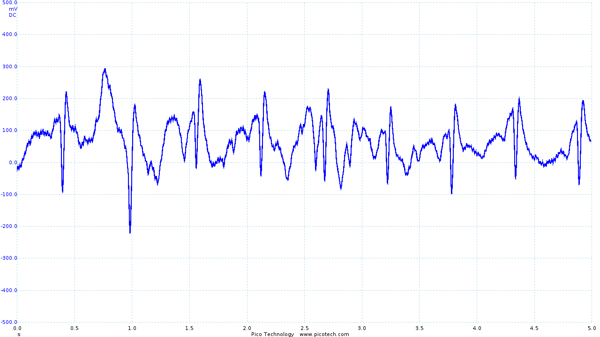

Hayden Ball
===========

My contribution to the project was focused on two areas: the project website and
working with Roy to design and build the sensor hardware.

Hardware
--------

The hardware element of the project consisted of designing sensors for the
health vest, installing them into the vest, and transferring data from the
sensors to the Android application which could then upload the data for further
processing and display.

The final design includes electrodes and analogue filtering circuitry to acquire
an electrocardiogram (ECG) of the wearer, and a sensor to allow monitoring of
the wearer's temperature.

The electrodes and temperature sensor are connected to a "belt pack" which
contained the ECG filtering circuit, a simple potential divider for the
temperature sensor, and the nRF51 Development Kit (nRF51-DK). The NRF51-DK
provides an easy interface to the nRF51822 microprocessor, which includes an
analogue to digital converter (ADC) and Bluetooth Low Energy transceiver.

### ECG Circuit

One of the more technically challenging aspects of the project was designing
and building a circuit for obtaining a clean ECG trace.

An ECG shows the change in electrical potential between two points on the body
caused by the depolarisation and repolarisation of different heart muscles.

At first, this may appear to be a trivial problem to solve - we simply need to
build an amplifier to amplify the difference in potential between two electrodes
attached to the body. Unfortunately, there are also a number of challenges to
overcome.

The differential signal we are trying to obtain is in the order of 500μV,
meaning we must obtain a gain of around 30dB to obtain a usable signal. This,
as is to be expected with high gain amplifiers, introduces a large amount of
noise into the signal.

We were also aware that the output of the circuit was to be sampled at 50Hz
(discussed in more detail in the "mbed programming" section below). To avoid
aliasing, we are forced to ensure that frequencies beyond 25Hz are sufficiently
filtered out (to conform with the Nyquist–Shannon sampling theorem).

While high-frequency components of an ECG trace can sometimes be of interest,
the maximum frequency of the basic QRS sequence is 10Hz, allowing us to filter
at slightly above 10Hz. This not only satisfies our sampling requirement but
also significantly reduces the amount of noise seen in the signal.

Roy was responsible for the initial circuit design (based on Jason Nguyen's
circuit [^1]), which I then built and tested. Following initial testing, Roy and
myself worked together to tackle the challenges described above.

#### Circuit refinement

The initial circuit provided a recognizable ECG trace, shown below.

Although recognizable, the trace obtained contains a large amount of noise as
the first iteration of the circuit made little attempt to filter noise.

Using a Picoscope, we were able to identify the frequency of the noise
introduced:

We identified the troublesome frequencies as being 50Hz and its harmonics
(100Hz, 200Hz, 400Hz, etc), which was likely introduced by our power supply.
However, as these are beyond our desired signal frequency of 10Hz, we were able
to simply add a 2nd order low pass filter to remove the noise.

The addition of the low pass filter had a significant impact, resulting in the
following output:

The frequency trace clearly shows our new 40dB/decade roll-off above the
frequencies of interest, effectively removing the majority of noise present.
This also had the advantage of meeting our requirement of reducing frequencies
beyond 25Hz, preventing any aliasing issues.

#### Circuit Evaluation

The ECG circuit generally performed pretty well, with P,Q,R,S and T sections of
the trace clearly visible.

One issue that was identified later in the project was that the output of the
circuit was biased at 4.5V. As the range of the ADC of the nRF51822 is 0 - 5V,
this meant that we were not taking full advantage of the available resolution of
the ADC, as we could have a maximum output swing of 1V.

While this turned out to not normally be an issue, we did occasionally find that
the ADC was saturated at 5V, so a future revision of the circuit would include
rebiasing the output to 2.5V.

It would also have been worth spending more time investigating "off the shelf"
alternatives - while the circuit performance was acceptable, better results may
have been obtained by using an IC such as the Analog Devices AD8232 [^L7].

### Vest Electrodes
Up to this point, we have been testing using "Skintact" electrodes - an "off the
shelf" product that is designed to achieve good electrical contact between the
electrode and the skin. Unfortunately, the electrodes are single use and are
also uncomfortable (particularly when removing them!).

As part of the project we wanted to integrate the ECG electrodes into the vest,
removing the need for single-use electrodes and providing more comfort to the
wearer. We also spent time investigating different placements of the electrodes,
with the aim of reducing movement artifacts (caused by electrical activity in
other muscles) and obtaining an acceptable input signal.

#### Electrode Placement

The generally accepted electrode placement for a 3 lead ECG has the -ve
electrode on the right side of the chest, just below the shoulder bone, the
ground electrode is placed on the left side of the chest, opposite the -ve
electrode and the +ve electrode is placed in the 5th or 6th intercostal space
on the left side of the chest. Unfortunately, very large movement artifacts are
easily introduced, causing a complete loss of our desired signal.

<table>
  <tr>
    <td>
      
    </td>
    <td>
      
    </td>
    <td>
      
    </td>
  </tr>
  <tr>
    <td></td>

    <td>
      With little movement, a very clear trace is obtained (although in the
      image the +ve and -ve electrodes have been incorrectly connected,
      resulting in an inverted trace).
    </td>

    <td>
      However, with movement, the trace becomes unintelligible.
    </td>
  </tr>
</table>

Roy and I investigated a number of different electrode placements, but after
a little research, I came across an alternative electrode configuration
which is recommended for use in exercise physiology (which involves large
amounts of movement during tests). The configuration, introduced in "Exercise
Physiology: Nutrition, Energy, and Human Performance" [^2], has the ground
electrode on the sternum, with the -ve and +ve electrodes in the 5th intercostal
space on each side of the chest.

This placement produces a satisfactory trace, pictured below, which is less
susceptible to movement artifacts.

<table>
  <tr>
    <td>
      
    </td>
    <td>
      
    </td>
  </tr>
</table>

This positioning is also suggested by Hakyung Cho and Joo Hyeon Lee in their
paper "A Study on the Optimal Positions of ECG Electrodes in a Garment for the
Design of ECG-Monitoring Clothing for Male" (sic) [^3].

When integrating the electrodes into the shirt (discussed in more detail below),
we found that moving the ground electrode to the right shoulder produced a very
similar trace but provided better contact with the skin.

#### Electrode design

Having decided on a suitable placement for the electrodes, I then spent a small
amount of time investigating different materials that could be used for the
electrodes. A number of papers ([^4][^5] to list two) have been published on
this subject in recent years, and provide interesting reading.

Unfortunately, the lead time and expense of such materials meant that it was not
practical to use such materials in the project. Instead, Roy and I attempted a
few different solutions.

One option that we considered was using parts of the Skintact electrodes, as
pictured below:

Unfortunately, we found that the sponge material used in the electrodes became
very fragile when it dried out, making it unsuitable for longer term use.

Another option was to use conductive copper tape. This was cut into small
sections of approximately 15mm, and stuck to the inside of the vest. While this
was somewhat successful, we found that performance was improved by adding a
slight bulge to the electrode. By wrapping the tape round a metal stud, the
contact area is pushed into the skin a little more, improving the contact surface.

#### Evaluation

The vest is relatively comfortable to wear, with the main discomfort being
caused by the poor integration of the signal wires into the vest.

The requirement to use a conductive gel is disappointing, and makes putting on
the vest difficult. While not particularly uncomfortable, the design would be
significantly improved if this requirement could be removed. Given the amount
of research into conductive materials and wearable technology, it is likely that
this could be overcome with a little more time and research.

The output obtained from the vest leaves much to be desired.

The R and S sections of the trace are quite clearly visible (although small),
with the Q section of the trace occasionally obtained. However, the T section of
the trace is significantly distorted, and the P section is rarely seen.

<table>
  <tr>
    <td>
      
    </td>
    <td>
      
    </td>
    <td>
      
    </td>
  </tr>

  <tr>
    <td>
      The trace obtained using Skintact electrodes
    </td>
    <td>
      The final output from the vest and ECG circuit
    </td>
    <td>
      Movement artifacts seen in the final output
    </td>
  </tr>
</table>

As seen above, movement is still an issue. However, even during movement R and S
sections of the ECG trace can be identified. While it has not been possible as
part of the project, I would like to investigate in the future whether
digital signal processing (particularly in combination with other sensors, such
as accelerometers) could be used to recover a reasonable ECG trace.

### Thermometer Circuit

A reasonably late addition to the vest was adding a thermister and incorporating
a potential divider circuit in the belt pack so that we could measure the body
temperature of the wearer.

I designed the (very simple) circuit for the sensor, which consisted of a
potential divider fed into an op-amp. The op-amp provided a suitably low output
impedance, ensuring that the measurement wasn't affected by current flowing into
the ADC of the nRF51822.

The thermistor was sewn into the vest under the right armpit. This is one of the
few locations on the body where skin temperature gives a good indication of core
body temperature.

The voltage produced by the potential divider was then converted into a
temperature by software running on the nRF51822, as discussed in the following
section.

#### Evaluation

The thermometer circuit was very simple and provided reasonable performance.
Further testing and validation of the performance of the sensor would be required
to give a more thorough evaluation of the sensor, as the sensor was only tested
at room temperature and body temperature due to time constraints.

### mbed Programming

I was solely responsible for writing the software that ran on the nRF51822.

For the most part, the software is very simple. As the mbed libraries contain
all the code required for the setup and use of the ADC and Bluetooth chip, all
that was required was to link the two together and perform simple arithmetic on
the temperature sensor readings to convert the obtained voltage to degrees
celsius.

#### ECG Sampling

In order to show high-frequency components of the ECG trace, we must sample the
ECG output as frequently as possible. Sampling was achieved by setting up a
`Ticker`, which interrupts the CPU at a defined interval and causes a reading
from the ADC to be taken. The value is then transmitted using Bluetooth Low
Energy.

Due to the overhead of sampling the analogue signal and transmitting the new
value, I found that the minimum practical interval for sampling was 20ms. This
gives a sampling frequency of 50Hz, which is sufficient for sampling signals of
up to 25Hz.

#### Temperature Sampling and Calculation

For the temperature measurement obtained to be useful, I needed to convert the
voltage obtained from the thermistor into degrees celsius. The temperature (in
degrees Kelvin) of a thermistor can be approximated using the extended
"Steinhart and Hart" formula:

$$
  T^{-1} = A_1 + B_1 \times ln(R / R_{ref}) + C_1 \times ln^2(R / R_{ref}) + D_1 \times ln^3(R/R_{ref})
$$

where $$A_1$$, $$B_1$$, $$C_1$$ and $$D_1$$ are constants specific to the
thermistor. These values were obtained from the thermistor's datasheet [^6].

Having calculated $$T$$, it was then simply a case of subtracting 273 to convert
to degrees celsius.

As body temperature changes relatively infrequently, the temperature was only
sampled once every second. While a smaller interval could have been used, this
would have increased the minimum sampling interval for the ECG sensor with
little gain.

#### Evaluation

The software was functional, ensuring that values obtained from the two sensors
were correctly sampled and transmitted. However, better sampling rates may have
been achieved by storing a number of samples and transmitting them in chunks
(reducing the amount of time spent transmitting).

If more time were available, it would be worth spending a significant amount of
time investigating more efficient ways of transmitting the data obtained, as
this would appear to be the major bottleneck in the system.

### Packaging

I sew the ECG electrodes, thermistor and stranded cable into the inside of a
compression shirt. This ensured that the sensors remained in the same place, and
the cabling was kept tidy.

The 5 cables coming out of the shirt were then loomed together using AT7 PVC
tape, and connected to a male 9 pin D-Type connector. Using a D-type connector
allows easy disconnection of the shirt from the belt pack, which allows the
shirt to be washed.

The ECG and thermometer circuits, together with 3 9V batteries and the nRF51-DK
were placed into a black plastic case. On the front of the case, I added a power
switch, indicator LED, and a female 9 pin D-Type connector. I also added 2 female
headers which were connected to the output of the ECG circuit to allow the
output to be recorded easily once the case has been closed for the purposes of
evaluation and composing the group's reports.

#### Evaluation

Unfortunately, the belt pack was very large. This is largely due to the size of
the nRF51-DK, and the ECG circuit PCB. This made it cumbersome to carry around,
and would need to be improved if more time were available. The compression shirt
worked reasonably well, although use of thinner stranded cable would have
reduced the small amount of discomfort caused by the routing of sensor cables.

Website
-------

I was also responsible for the design and implementation of the group website.

The website has two primary functions - as well as hosting the group's reports,
the website also displays the data obtained from the health monitoring vest.

The website has been built as a "mock-up" of what a production site may look
like, with the homepage advertising the product and a dashboard for users to view
data obtained from the vest.

Users would use the "Login" button in the top left to access their own data.
Since the API does not yet handle authentication, any email address and password
may be used to login at this time. Unfortunately, the "historic" BPM graph is
also only a proof of concept, as the data has not been presented by the API.

Taking into account the web hosting facilities that were made available, I
decided it would be best to create a "static" website (that is, one where pages
are not generated by the server when they are requested) and make use of
javascript to pull data from the API server and Firebase.

### Backbone

In order to increase the maintainability of the site, I decided to use the
Backbone.JS [^L1] library which provides base classes for models, collections,
and views. This allows a developer to easily split a potentially fairly large
amount of javascript into discrete components.

On top of Backbone.JS, I also used the Marionette library [^L2] which removes a
large amount of "boilerplate" code that is often associated with Backbone
applications.

### Gulp

A number of different tools have been used to make developing the
website easier. JavaScript code has been written in CoffeeScript [^L3], as this makes
files easier to read and provides a number of useful features such as classes
(which aren't otherwise available in JavaScript). Stylesheets have been written
using SCSS [^L4], which allows classes to be nested and also provides a number of
useful helper functions.

Both of these tools require that code is compiled before it can be served to the
user. Add to this a number of libraries that have made front-end development
easier (such as the Bootstrap CSS library [^L5]), and it is clear that the build
process is non-trivial.

Thankfully, a number of tools exist to automate the build process. I decided to
use Gulp [^L6] - a relatively new tool designed for automating build processes
that I hadn't used before - as this provided a good opportunity to learn how to
use it.

Gulp is configured using a `gulpfile`, which defines a number of task "streams".
A stream is created by selecting source files (such as CoffeeScript files), then
run through a plugin that performs some manipulation on the stream (such as
a CoffeeScript compiler), then output to target - either a single file or a
directory.

The final `gulpfile` is available in the `website` section of the source code,
and defines tasks for compiling CoffeeScript, SCSS, handlebars templates, and
markdown, as well as tasks for moving dependencies into accessible locations.

### Evaluation

The website is currently fairly simple, but successfully shows the data obtained
from the vest. It has been written in such a way that adding additional sensors
and features would be relatively simple.

References
----------

[^1]:
  Homemade Electrocardiograph
  Jason Nguyen
  http://www.eng.utah.edu/~jnguyen/ecg/long_story_3.html
  Accessed 2015-10-12

[^2]:
  Exercise Physiology: Nutrition, Energy, and Human Performance
  William D. McArdle, Frank I. Katch, Victor L. Katch
  PP327

[^3]:
  A Study on the Optimal Positions of ECG Electrodes in a Garment for the Design of ECG-Monitoring Clothing for Male
  Hakyung Cho, Joo Hyeon Lee
  Journal of Medical Systems, 2015, Vol.39(9), pp.1-14

[^4]:
  Wearable Textile Electrodes for ECG Measurement
  Lukas Vojtech, Radoslav Bortel, Marek Neruda, Milos Kozak
  Advances in Electrical and Electronic Engineering, 01 January 2013, Vol.11(5), pp.410-414

[^5]:
  Fabrication of conductive fabric as textile electrode for ECG monitoring
  Yun Zhou, Xin Ding, Jingwei Zhang, Yaru Duan, Jiyong Hu, Xudong Yang
  Fibers and Polymers, 2014, Vol.15(11), pp.2260-226

[^6]:
  Vishay NTCLE100E3 NTC Thermistors Data Sheet
  http://www.farnell.com/datasheets/1784420.pdf

Links
-----

[^L1]:
  http://backbonejs.org

[^L2]:
  http://marionettejs.com/

[^L3]:
  http://coffeescript.org/

[^L4]:
  http://sass-lang.com/

[^L5]:
  http://getbootstrap.com/

[^L6]:
  http://gulpjs.com/

[^L7]:
  http://www.analog.com/en/products/application-specific/medical/ecg/ad8232.html
