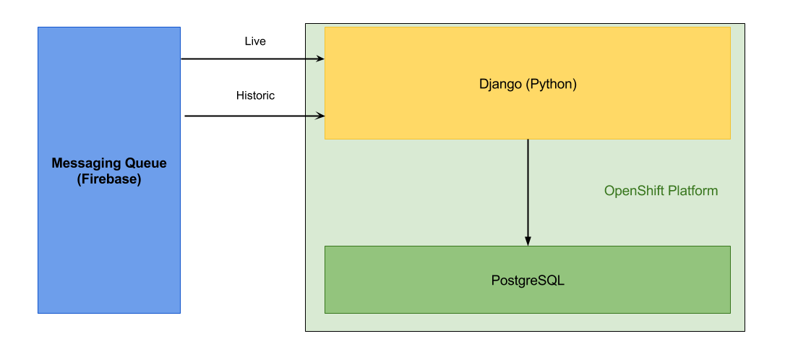

Outline
____________
1. What is it?
    * What does it do
    * How could a client use it
    * Medican usage
2. Components of the system
3. Team Members and Responsibilities
4. Hardware
5. Mobile app
6. API
7. Processing
8. Web interface
9. Conclusion
    * Future work
    * improvements
    * Health applications

Introduction
------------

Team Members and Responsibilities
------------

* [Filip Frahm](filip.html) - Data Analysis
* [Hayden Ball](hayden.html) - Hardware and Website
* [Jonathan Redmond](jonathan.html) - Android App
* [Milan Pavlik](milan.html) - API
* [Roy Hotrabhavnon](roy.html) - Hardware

Hardware
--------

The UberVest hardware consists of two parts: a compression shirt containing
electrodes and sensors, and a beltpack that contains signal processing circuits
and the nRF51-DK board. These two components are modular and can be removed from each other
allowing for the shirt to be hand washed.

The final design included electrodes and active low pass filtering circuitry to
aquire an electrocardiogram (ECG) of the wearer of the shirt, and a sensor to
allow monitoring of the wearer's temperature.

The design made use of the analogue to digital converter and Bluetooth Low
Energy tranciever available in the nRF51822 microprocessor, which is included
on the nRF51-DK. This allows us to read values from the analogue sensors and
transmit the data on to the Android app.

Mobile App
----------

The mobile app is how we read data from the device and push it to Firebase. This
is done with a background thread that constantly checks for changes in the devices
Bluetooth Low Energy characteristics. When a change occurs, the data is pulled
from the device and converted into a standard int/float format. This data is then
timestamped and pushed to Firebase for the API to process.

In the foreground, the app is displaying the data that is coming out of the API
with a live ECG trace and temperature reading. The app is designed to be quick
and simple to use, on the first start-up the user is taken to a log-in page.
After they have entered their details the app automatically starts reading data
and pushing it to Firebase, so the user doesn't have to wait or do anything
complicated to start using the device.

API
-------------
The application interface aims to bridge the gap between the wearable device and the web interface. By focusing on processing and storage of raw sensory data received from the wearable, it allows us to decouple individual systems into the project. The primary focus of the api is on storage of relational data such as users and their respective devices as well as storage of processed data received from the wearable and making it available for future retrieval.

The API is composed of a Django application which implements a RESTful interface in order to allow the web interface to query relational data stored inside a PosgreSQL database. The same interface is also employed for storage of processed BPM data in order to allow future retrieval.

With the aim of making the project accessible in the public domain, we have deployed the application on a free tier of the OpenShift platform. This has allowed us to keep the costs down as well as make the project available to anyone.

From the diagram above, you can observe that the two data sources - PosgreSQL and Firebase are decoupled with the API serving as a bridge. Firebase is primarily used as a storage of raw data and live information whereas the relational database focuses on longer term storage of information. The architecutre of the application allows us to be flexible with information flow and provides increased development velocity.

Web Interface
-------------

The website provides an overview of the data being collected by the UberVest,
with a live ECG trace and the last aquired temperature being shown to a signed
in user.

Data displayed on the website is pulled from the UberVest API, with live data
being pushed out by Firebase[^L1].

Data Processing and Analysis
--------

Data processing and analysis consists largely of the generation of a live beats
per minute (BPM) feed. Some research and experimentation on future applications of a
respiratory sensor has also been completed.

The live BPM feed takes a moving window (between 4 and 15 seconds) as argument and
returns a BPM value. ECG data is filtered through multiple methods to identify beats
and then extrapolated to 60 seconds.

With regard to the potential future applications of the respiratory sensor, a method
has been explored and tested to rank patients by their respiratory fitness and an
experiment has been conducted to determine how good an indicator mean respiratory flow
is of a young healthy individual's fitness.

Applications in Health and Sport
--------

Both in health and sport, the use of data analytics is becoming more and more popular.
One significant example of this is Calico, a Google-backed biotechnology company that
has recently gained access to Ancestry.com's genetic database with the intention of using
genetic and family tree related data to improve the human lifespan. Another is the usage
of GPS tracking devices in Rugby. We believe that the UberVest is could add to the
possiblities of data analytics by providing data. Due to the low cost nature of the hardware
the UberVest is accesible to everyone and not just medical professionals. Bringing Medical level data/insight within reach of commercial users. We have also selected some applications that the UberVest could work towards:
1. Heart attack / stroke detection
2. Analysis of continuous temperature monitoring
3. Automatic detection of severe exacterbations in COPD patients (through continuous respiratory monitoring)
4. Respiratory and general fitness testing (for personal use and to identify at risk individuals)

Links
-----

[^L1]: http://firebase.io
