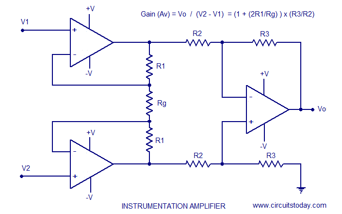
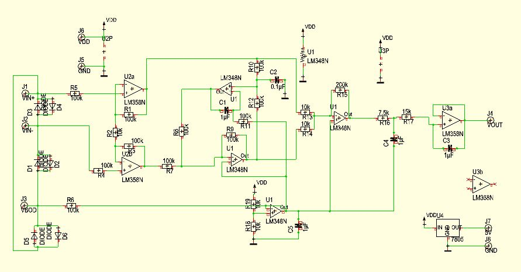
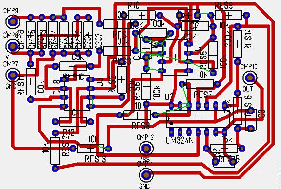
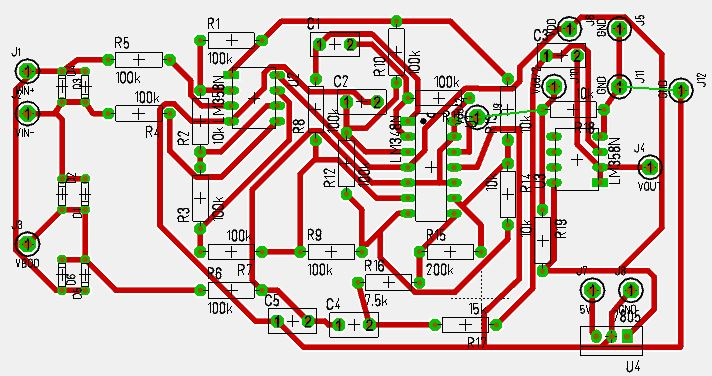
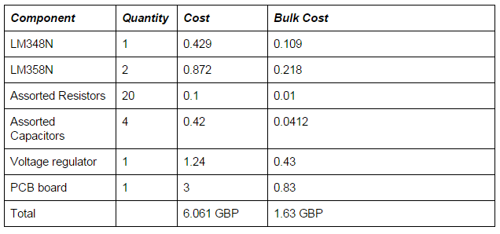

Sukrit (Roy) Hotrabhvanon
=========================

Introduction
------------

The objective of this project is to create a functioning health monitoring vest to aid those recently in recovery from accidents/post-op or those with chronic conditions who need to be monitored when they are put under stress/exercise. There are applications in sports science as well, namely the ability to track athletes biometrics to a higher level than the standard heart rate detection bracelets.  

The Problem
-----------

There exists no product on the market within the consumer price range that permits the live readout of biosignals to an internet connected device. Thereby allowing remote monitoring of a patient and continuous data gathering. Thereby giving doctors access to more data remotely, and resulting in the patient gaining increased freedom post recovery whilst maintaining peace of mind.

The Biosensors
--------------

Sensors that would be useful for remote monitoring of the patient include:

ECG - For heart rate monitoring and pre arrhythmia detection.
Respiratory Sensor - Monitoring of the breathing rate especially useful for watching for problematic breathing pattern symptoms post operation.
Temperature Sensor - Monitoring of skin temperature, useful during exercise to prevent sudden heat exhaustion.

My Contribution
---------------

My contribution to this project was purely hardware based. Due to the fact that we decided on to make the project as low cost and accessible as possible, we had to design the circuit from the ground up without using any pre built circuit boards apart from the prospeckt to allow us to easily set up a bluetooth connection. As normal with analog circuits and very small signals the design process is relatively complicated leading for me to collaborate with Hayden Ball to share the workload throughout the design process.

Part 1 - Building the ECG Circuit
---------------------------------

The electrical potential of the heart that is picked up by the electrode pads vary from 1mv - 5mv, presenting us with a very difficult signal amplification problem due to the size of the signal. However the first design decision that we had to make was to decide on how many leads our ECG unit would have. Typical medical units have 4 - 5 pads taking signal samples from different places on the chest to yield a cleaner signal. However due to the complexity we decided to build a 3 lead ECG system having 3 leads. V+, V- and a ground.
At its most basic we have a signal amplification problem that can be split into three stages.

Preamplification - > Active Filtering - > Output Gain stage.

Now that we have what our inputs are going to be, let define our ideal output. We want our output signal to have a voltage swing of less than ½ VDD with the signal itself being biased at ½ VDD to make it compatible with ADC’s. We also want our signal to be as clean as possible without losing information from the ECG trace, this would entail some sort of filtering.

Selecting Vdd
-------------

Due to the fact that the prospeckt runs on a 3.3v power supply to keep the circuit its most simple power wise it would mean picking a 3.3v power source. However, if we were to select 3.3v for our ECG power supply it would mean that the signal would be biased at 1.515v and the swing would be less than that. This presents a major problem when we want come to the ADC stage as a lower voltage would mean less quantization levels and therefore much less resolution when the analog signal is digitalized. This is not an acceptable trade-off.

The next best solution is to run the whole circuit off 9V batteries and use a voltage regulator to step down the power for the prospeckt board. This leaves the ECG circuit with a 4.5v bias and around a 3v swing based on the gain. This should therefore yield adequate resolution when passed through the ADC.

Another power problem
---------------------

Another problem we must consider is that Op-Amps usually require a V+ and V- and ground power supply as they are normally biased at 0v. As our power supply range is 0 - 9V we can set V+ to be 9v and V- to be 0v. However we must therefore set GND to be 4.5v on the Op-Amp for the chip to function normally. In electrical engineering this is called the creation of a virtual ground.
We can create a virtual ground in two ways, using a potential divider or in this case we have used an Op-Amp as it has a better current output. (Also due to the fact that multiple Op-Amps are put on chips it works out well as there are usually unused spares).

Gain selection
--------------

This is the most important part of the circuit, the amplification of the signal. For this we will be doing a differential amplification on the V+ and V- electrodes. The first stage of this is to pre amplify the signal as to be able to conduct filtering for it. What we did was to amplify V+ and V- by 10 times by setting the resistors to 10k and 100k on the Op-Amps.
At the output stage I combined both signals from the preamp stage into a single output amplifier with a gain of 20, 200k/10k resistors used to create this amplifier.

Essentially the circuit we have now is what is called an instrumentation amplifier as shown below.

Whose gain is given by Av = 1 + 2R/Rb
Which therefore gives us an overall gain of 20, thereby we would be expecting a 0- 1.5 volt swing voltage on the output which puts it neatly within all our defined margins of Vswing < Vdd/2 meaning that the signal will never go out of scope and “hit the rails”.

Opto Isolation
--------------

This is a very important safety aspect of the design, we require there to be no way for any current to be fed back towards the electrodes. As even small currents placed across the heart and stop it and hence is incredibly dangerous! JNuguyen [1] had the wrote about the idea of instead of using dedicated opto isolating hardware, just by placing a series of diodes across all the inputs it will mean for the case that the voltage difference between them is <0.7v there will be no current flowing between the electrodes. As the voltages between the electrodes are in the millivolts the case where current is allowed to flow between the electrodes is highly statistically improbable[1].

Putting the circuit all together
--------------------------------

Now that we have the power supply, the instrumentation amplifier circuit, the virtual ground circuit and the optoisolation we are ready to put all the pieces together to form the full circuit. I tested JNuguyen active low pass filter [1] design using the picoscope and integrated it into the middle of our instrument amplifier before the output gain stage and before the pre-amp. Hayden then added an additional filter at the output of the circuit to remove power line noise. I then generated the schematic in TARGET; a circuit/PCB manufacturing program.

The final circuit diagram is shown below.

Testing and additional filtering
During testing Hayden and I found a lot of noise artifacts which once we did a spectrum analysis using the picoscope we found it to occur at the power line frequency (50Hz) and its harmonics (100Hz,200Hz,400Hz...) The picture below illustrates the signal ECG signal with this interference.

<table>
  <tr>
    <td>
      
    </td>
  </tr>
  <tr class="img-caption">
    <td>
      Initial ECG circuit output before filtering
    </td>
  </tr>
</table>

##### The spectrum analysis of the signal
<table>
  <tr>
    <td>
      
    </td>
  </tr>
  <tr class="img-caption">
    <td>
      Frequency analysis of the output of the initial ECG circuit
    </td>
  </tr>
</table>

Since all our information is at 10Hz and below Hayden built another low pass filter on the output stage to cut off frequencies of greater than 10Hz which he calculated from first principles. And resulted in the following ECG output trace and spectrum signal.

<table>
  <tr>
    <td>
      
    </td>
    <td>
      
    </td>
  </tr>
  <tr class="img-caption">
    <td>
      ECG trace with the output stage filter
    </td>
    <td>
      FFT of the filtered ECG trace
    </td>
  </tr>
</table>

Evaluation of the ECG Circuit
-----------------------------
The circuit performs and amplifies well whilst reducing noise artifacts. A major improvement would be to allow the circuit gains to be adjusted. I would implement this by putting a variable resistor on the OpAmp of the output stage. This would allow the user to rescale the output signal to fit in their desired window and also would mean that the power supply could be varied thereby creating a more generic circuit that fits in more systems. In addition to this implementing an adjustable DC offset that would mean you would be able to rebias the signal to stop the signal hitting the rails.

Conversion from the Breadboard to PCB Design
<<<<<<< HEAD
Once we had tested the breadboard and determined it the circuit had designed met the specification, I began the process of converting the schematic into a PCB by hand routing the components and the tracks to minimise the space of the board. The initial design below fit in a 6x4 cm area sized board.
<table>
  <tr>
    <td>
      
    </td>
  </tr>
  <tr class="img-caption">
    <td>
      Version 1 of the PCB Design
    </td>
  </tr>
</table>

However I had made a mistake in the design and mixed up the orientation of the chip requiring a redesign. For the second attempt I combined hand routing and auto-routing algorithms to speed up the process (as we were very close to the demo day). The trade off was that the board was significantly larger than the initial version, but it worked.

<table>
  <tr>
    <td>
      
    </td>
  </tr>
  <tr class="img-caption">
    <td>
      Version 2 of the PCB Design
    </td>
  </tr>
</table>

Future PCB improvements
We were limited to using single layer and through hole technology in the design and production of this PCB, resulting in a larger PCB than practical. However the exact same circuit replaced by the SMD version of its components would be the size of a 50p coin making it perfect to be sown into the lining of a shirt.

=======
--------------------------------------------
Once we had tested the breadboard and determined it the circuit had designed met the specification, I began the process of converting the schematic into a PCB by hand routing the components and the tracks to minimise the space of the board. The initial design below fit in a 6x4 cm area sized board. However I had made a mistake in the design and mixed up the orientation of the chip requiring a redesign. For the second attempt I combined hand routing and auto-routing algorithms to speed up the process (as we were very close to the demo day). The trade off was that the board was significantly larger than the initial version, but it worked.

Future PCB improvements
-----------------------
We were limited to using single layer and through hole technology in the design and production of this PCB, resulting in a larger PCB than practical. However the exact same circuit replaced by the SMD version of its components would be the size of a 50p coin making it perfect to be sown into the lining of a shirt.

Costing
-------
As the primary goal of this was to make it as accessible/cheap as possible whilst not sacrificing performance. Below is a cost estimate of the components and estimates of scale for bulk manufacture.

<table>
  <tr>
    <td>
      
    </td>
  </tr>
  <tr class="img-caption">
    <td>
      Version 2 of the PCB Design
    </td>
  </tr>
</table>

As shown by the table above the cost of a single unit is 6.061 GBP however in bulk (1000 units +) the cost drops massively to 1.63 GBP. Of course this cost does not include the price of the prospeckt board but this price is incredibly reasonable for the results that we gathered from it.

Shirt and Electrode placement
-----------------------------
For the electrode placement we started with the standard medical recommended placement which is the V+ and V- electrodes located as shown in the diagram below. However, unfortunately through testing although this yielded a clear ECG trace the electrodes were placed on muscle masses that are very prone to movement hence we completely lost the signal during any kind of light movement.

diagram

Hayden then found a paper that described a better ECG placement with specific use in wearables, targeting muscle masses and ground points that are less likely prone to movement therefore yielding a cleaner signal with light movement. However, it is still not perfect and there is lots of room for improvement as the signal would still not be acceptable if the user was jogging.

As our ambition was to for the vest to be reusable we decided that we were going to look into creating our own electrodes (spearheaded by Hayden). Because of this I obtained a compression base layer top as the thinking was it should be tight enough to compress our electrodes into the skin without requiring the traditional adhesives. (Thereby making it reusable). Our electrode designs were sewn into the inside of the compression layer top meaning all the user has to do is to put the top on.

Issues developed with contact against the skin and unfortunately we had to succumb to using electrode gel on the pads to increase the contact/conductivity. This is an area of the hardware system that can be improved. With more time better research into different electrode materials such as using conductive cloth and designing a strap which would allow the user to adjust the pressure of the electrodes on the skin. Another major issue is our naivety that we could design a one size fits all vest with fixed electrodes. I believe the best solution in the future to solve this problem is to design a one size fits all vest with removable adhesive electrodes so the position can be altered and fine tuned for every user. As this design would require disposables it is not the most cost effective solution but strikes a good balance between ease of use and quality.

References
----------

[^1]:
  Homemade ECG
  J Nguyen
  http://www.eng.utah.edu/~jnguyen/ecg/long_story_3.html
  Accessed 2015-10-1
